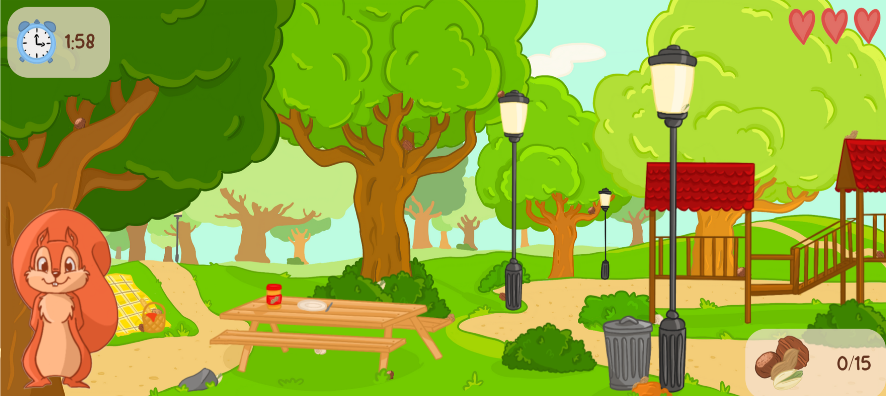

# 🐿️ **Peek-A-Nut**

> Peek-A-Nut is a cozy hidden object game where you help Hazel the squirrel gather nuts before winter! Search, click, and collect while avoiding tricky decoys—all within a limited time! 🌰✨

---

## 🌐 **Play the Game**

---

## 📸 **Screenshots**

### Main Gameplay:

  
  
---

### Menu and UI:

---

## 🎨 **Spritesheets**

### Hazel the squirrel:

---

## ✍️ **Reflection**

### What went well:
- **Core Mechanics:** The project I chose was challenging but at the same time very manageable, therefore I had a lot of fun creating this game.
- **Creative Design:** Desgining the background as well as the squirrel was very fun and enjoyable, even though it was a lot I still was able to be creative about it and I'm very proud of it - especially my spritesheet :).

### Challenges:
- **Working with different files:** Surprisingly this was one of the more trickier things for me while coding. It got pretty confusing in the end and most of my bugs were the outcome of me not quite understanding/realizing I linked something wrong, etc.
- **Spritesheets:** Creating the spritesheets on ProCreate was my first mistake.. It was all very precise work to draw every sprite as well as getting the squirrel on the right position. 

### Lessons Learned:
- **Prototyping is important!!:** As soon as I was done on the 23rd I asked a few colleagues to test my game to see if the 2 minutes timer is realistic or not. While testing one of them found a bug that I wasn't even aware of. It was something quite "big" but also a easy to fix in the end. :)
- **Ask for Help:** Part of me wanted to handle everything alone, but I knew that wasn’t realistic. So, I reached out for help, and more often than not, it gave me a much-needed motivation boost, helping me get back on track quickly.
